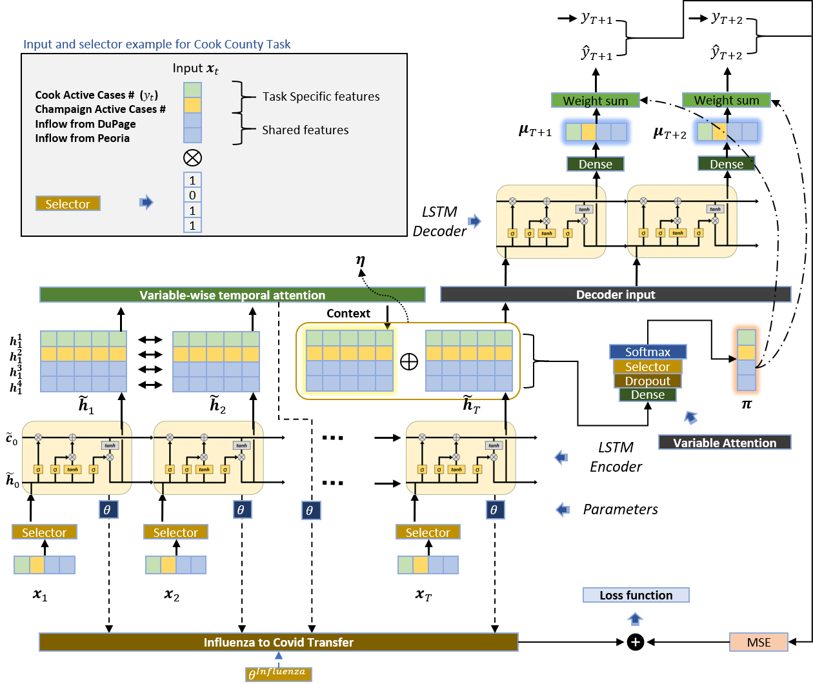
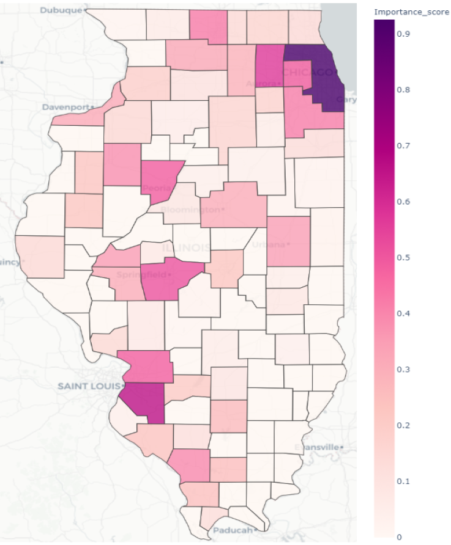
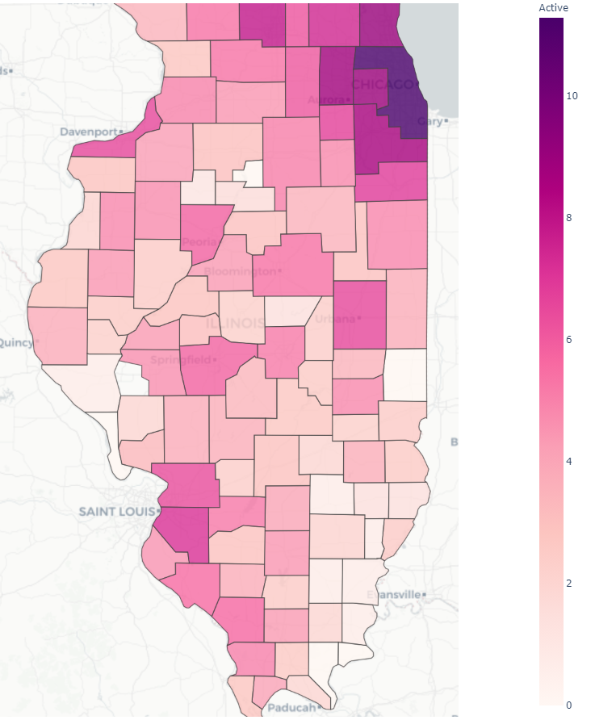
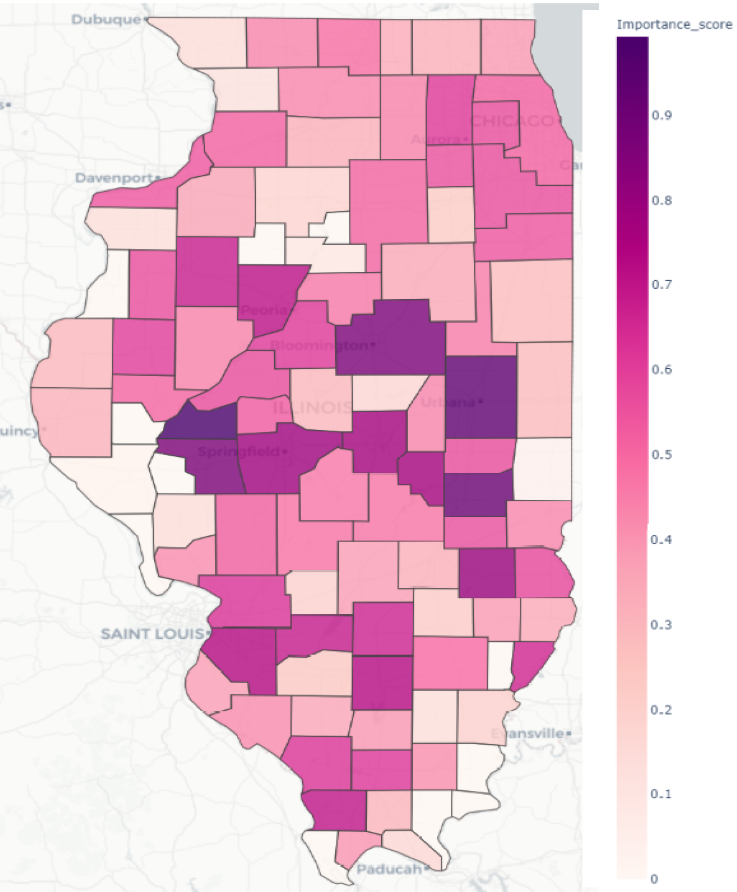
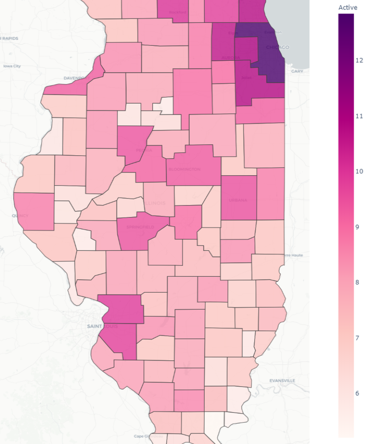

## Hotspots for Emerging Epidemics: Multi-Task and Transfer Learning over Mobility Networks

[Shuai Hao](https://giesbusiness.illinois.edu/profile/shuai-hao),
[Yuqian Xu](https://sites.google.com/site/lillianyuqian/home),
[Ujjal Kumar Mukherjee](https://giesbusiness.illinois.edu/profile/ujjal-mukherjee),
[Sridhar Seshadri](https://giesbusiness.illinois.edu/profile/sridhar-seshadri),
[Sebastian Souyris](https://giesbusiness.illinois.edu/profile/sebastian-souyris),
[Anton Ivanov](https://giesbusiness.illinois.edu/profile/anton-ivanov),
[Eren Ahsen](https://gies.illinois.edu/profile/mehmet-ahsen),
[Padmavati Sridhar](https://www.linkedin.com/in/psridhar2147/)

[HEART Analytics home page](https://heart-analytics.github.io/Home/)

The sudden emergence of epidemics such as COVID-19 entails economic and social challenges requiring immediate attention from policymakers. An essential building block in implementing mitigation policies (e.g., lockdown, testing, and vaccination) is the prediction of potential hotspots, defined as the locations that contribute significantly to the spatial diffusion of infections. During the initial stages of an epidemic, information related to the pathways of spatial diffusion of infection is not fully observable, making the detection of hotspots difficult. Currently, policymakers rely primarily on the observed new infections for identifying hotspots and deciding on mitigation actions, which are reactive rather than proactive. This work proposes a new data-driven framework to identify hotspots through advanced analytical methodologies, e.g., a combination of the Long Short-Term Memory (LSTM) model, multi-task learning, and transfer learning. Our methodology considers mobility within and across locations, the primary driving factor for the diffusion of infection over a network of connected locations. Additionally, to augment the signals of infection diffusion and the emergence of hotspots, we use transfer learning with data from past influenza transmissions, which follow a similar transmission mechanism as COVID-19. To illustrate the practical importance of our framework in deciding on lockdown policies, we compare the hotspots-based policy with a pure infection load-based policy. We show that the hotspots-based proactive lockdown policy leads to a 21\% reduction in the new infections in our illustrative example. Finally, we demonstrate that the inclusion of transfer learning improves the hotspot prediction accuracy by 53.4\%. Our paper addresses a practical problem of proactive hotspot detection by implementing an appropriate combination of data-driven machine learning methodologies that considers the underlying drivers of infection transmission and information from past similar infections. Policymakers can use the proposed framework to improve mitigation decisions related to the control of epidemics.

Download the [paper](https://papers.ssrn.com/sol3/papers.cfm?abstract_id=3858274).

Access the [code](/evaluation/baselines.py).

**A Standard LSTM Cell Architecture**

**Full Model Framework**  
Following figure illustrates the multi-task interpretable LSTM model with transfer learning, where *θInfluenza* is the corresponding parameter learned from the influenza data as an input. It startsfrom the input sequence {**x**1,···,**x**t} and ends with the loss function. We consider the case of Cook and Champaign counties. To jointly estimate the two counties, the input vector **x**t contains the task-specific features for both Cook(colored in green) and Champaign (colored in yellow) counties and their shared features (colored in blue) with *Ñ* = 4. The goal is to conduct two-step ahead predictions for Cook County.

**Transmission vs. Infection-Case Hotspots in IL**

Transmission Hotspots  Apr-Jun 2020| Infection-Case Hotspots Apr-Jun 2020 |
:-: | :-: |
 |  |
**Transmission Hotspots  Oct-Dec 2020** | **Infection-Case Hotspots Oct-Dec 2020** |
  |  |
